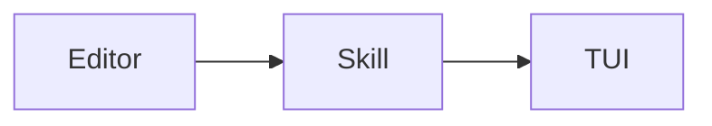
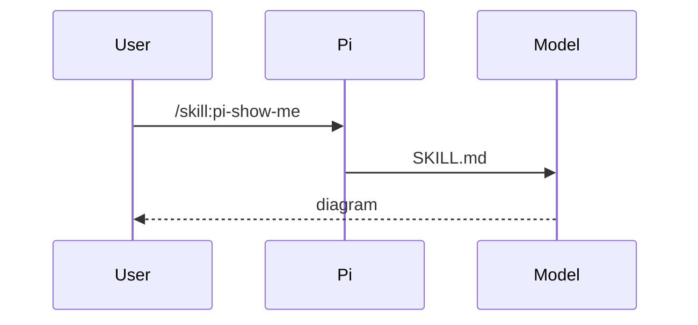

# Show me

Smallest visual. Almost no prose. One shape, two at most. Do not narrate it. Inspect named files first.

If this TUI draws `mermaid` fences and `$...$` / `$$...$$` as Unicode (Pi ≥ 0.84 or a mermaid/math extension), prefer those. Otherwise emit the plain-text shapes below — never a mermaid/latex fence the TUI will show as source.

## Mermaid

Only when the TUI renders it. Only: `flowchart`, `sequenceDiagram`, `stateDiagram-v2`, `classDiagram`, `erDiagram`.
flow → `flowchart LR|TB`; handshake → `sequenceDiagram`; states → `stateDiagram-v2`; types → `classDiagram`; schema → `erDiagram`.
≤12 nodes, short labels, no subgraphs. Wider than ~80 cols → tree. Never pie/gantt/git/mindmap/sankey/xy.
If mermaid will not render, write a `text` tree instead.



Bad: long node text, or a type Pi cannot draw (`pie`).



Bad: a TB flowchart with sentence-length labels for the same handshake.

## LaTeX

Only when the TUI renders math. Inline `$E=mc^2$`. Display `$$ \frac{a}{b} $$`.
OK: greek, `\frac`, `\sum`/`\int`/`\prod`, `_`/`^`, `\sqrt`, `\text{}`, `\begin{cases|pmatrix|bmatrix|align}`.
No TikZ, packages, or macros. If it will not render, write Unicode.

Good: `$$x^*=\arg\min_x \frac12\|Ax-b\|^2$$`
Bad: `\usepackage`, `\newcommand`, `tikzpicture`.

## Other shapes

Default when mermaid/latex will not render, or when those formats are the wrong shape.

```text
submitForm
  createSession
    persistPrompt
    launchAgent
```

```text
skills/show-me/SKILL.md   # this skill
package.json              # pi.skills += ./skills
```

```diff
 submitForm
   createSession
+    expandSkill
     launchAgent
```

```ts
function renderCallTree(root: CallNode): string;
```

Bad: prose in the tree, dumping the repo, implementing the API "to show it", or restating a diff in a paragraph.

## HTML last resort

Layout/mock only. One file at `/tmp/pi-show-me/<slug>.html` (never the repo). Open it, then link it:

Self-contained only: inline CSS/JS, no external scripts, fonts, images, or fetch/XHR — it will be opened in the user's browser.

`[open preview](file:///tmp/pi-show-me/<slug>.html)`

`open … || xdg-open …`

Bad: HTML in the repo, or HTML for something a 4-node flowchart could say.
