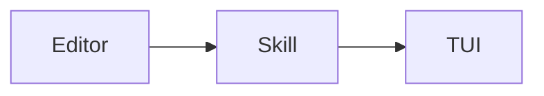
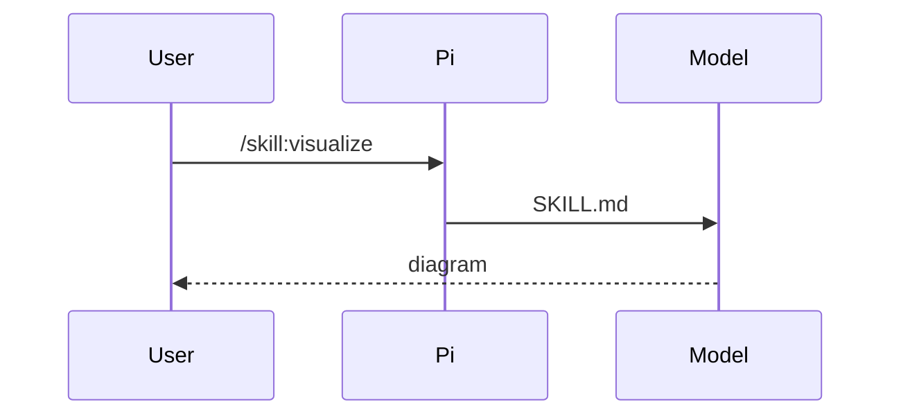

# Visualize

Use the smallest useful visual and almost no prose. Prefer one shape; use at most two. Do not narrate the visual. Inspect named files first.

If this TUI draws `mermaid` fences and `$...$` / `$$...$$` as Unicode (Pi ≥ 0.84 or a Mermaid/math extension), prefer those. Otherwise emit the plain-text shapes below—never a Mermaid/LaTeX fence the TUI will show as source.

## Mermaid

Only when the TUI renders it. Use only `flowchart`, `sequenceDiagram`, `stateDiagram-v2`, `classDiagram`, or `erDiagram`.

- Flow → `flowchart LR|TB`
- Handshake → `sequenceDiagram`
- States → `stateDiagram-v2`
- Types → `classDiagram`
- Schema → `erDiagram`

Use at most 12 nodes, short labels, and no subgraphs. If it would be wider than about 80 columns, use a tree. Never use pie, Gantt, Git, mind map, Sankey, or XY diagrams. If Mermaid will not render, write a `text` tree instead.



Bad: long node text or a diagram type Pi cannot draw.



Bad: a top-to-bottom flowchart with sentence-length labels for the same handshake.

## LaTeX

Only when the TUI renders math. Use inline `$E=mc^2$` or display math:

$$x^*=\arg\min_x \frac12\|Ax-b\|^2$$

Allowed: Greek letters, `\frac`, `\sum`, `\int`, `\prod`, subscripts, superscripts, `\sqrt`, `\text{}`, and `cases`, `pmatrix`, `bmatrix`, or `align` environments.

Do not use TikZ, packages, or custom macros. If math will not render, write Unicode.

## Other shapes

Use these when Mermaid or LaTeX will not render, or when another shape is clearer.

```text
submitForm
  createSession
    persistPrompt
    launchAgent
```

```text
skills/visualize/SKILL.md  # this skill
package.json               # pi.skills += ./skills
```

```diff
 submitForm
   createSession
+    expandSkill
     launchAgent
```

```ts
function renderCallTree(root: CallNode): string;
```

Do not dump the repository, implement an API merely to show it, or restate a diff in a paragraph.

## HTML last resort

Use HTML only for a layout or mockup that simpler shapes cannot express. Create one self-contained file at `/tmp/visualize/<slug>.html`, never in the repository. Use inline CSS and JavaScript with no external scripts, fonts, images, fetch, or XHR. Open it, then link it:

`[open preview](file:///tmp/visualize/<slug>.html)`

`open … || xdg-open …`
